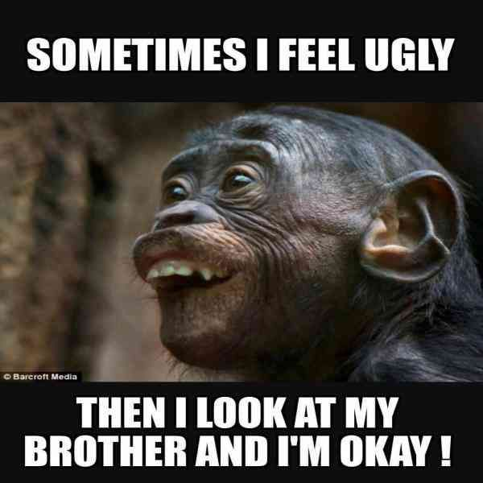

# 13 Reasons why I wish I was an only child
Welcome to my *oh god why didn't my parents have me first **and** last* page.

*Note: this is only satire, I only hate him most of the time; he provides the hot gossip the other times*

## My Inspiration
My *lovely* brother has the magical ability to make me feel the need to use my **CAPITAL LETTERS** voice outside typing and in the real world :')
The purpose of my repo is to demonstrate the level of *annoyance* my brother subjects me to on a daily basis.

## Reasons

1. He's ugly
2. He smells
3. Doesn't make me food
4. Doesn't spend all of his money on me
5. Weird
6. Barges into my room to stare at himself in my mirror and then leaves
7.  Farts a lot
8.  Hogs the bathroom
9.  He won't buy me a puppy
10.  Waits outside my room to scare me with his ugly face
11.  Embarrassng to take outin public
12.  Did I say he's ugly?
13.  He stares at me to annoy me

[](my_meme.png)

## How you can cope with a defective sibling::
### Distractions:
Amazing distractions from your siblings' existence could be [Miniclip](https://www.miniclip.com/games/en/#privacy-settings), [Cool Math Games](https://www.coolmathgames.com/), [Earn to Die](https://earntodie.co/), [Fun Brain](https://www.funbrain.com/), or [Super Mario](https://supermario-game.com/).

*-Please be advised that overuse of these games could have adverse affects on prodictivity and increase procrastination and effectively ruin your life-*

Other distractions may include annoying him back till he leaves you alone or watching the show *How to Get Away with Murder*.

### **Express your want to be an only child through RStudio:**


```r
library(magick)

suspicious_spongebob <- image_read("https://i.redd.it/vrqc1u43lab31.jpg") %>%
  image_scale(500)

annoyed_spongebob <- image_read("https://i.imgflip.com/5l3pc.jpg") %>%
  image_scale(500)

time_lapse <- image_read("https://media.vlipsy.com/vlips/gyck95iN/preview.jpg") %>%
  image_scale(500)

done_spongebob <- image_read("https://static.wikia.nocookie.net/parody/images/8/88/Piss_Off_SpongeBob.jpg/revision/latest?cb=20200728113229") %>%
  image_scale(500)


suspicious_text <- image_blank(width = 500, 
                       height = 400, 
                       color = "#FFFFFF") %>%
  image_annotate(text = "When my brother \n stares at me",
                 color = "#000000",
                 size = 60,
                 font = "Impact",
                 gravity = "center")
                 


done_text <- image_blank(width = 500, 
                          height = 400, 
                          color = "#FFFFFF") %>%
  image_annotate(text = "When my brother \n finally says \n something",
                 color = "#000000",
                 size = 60,
                 font = "Impact",
                 gravity = "center")

first_row <- c(suspicious_text, suspicious_spongebob) %>%
  image_append()

second_row <- c(time_lapse, annoyed_spongebob) %>%
  image_append()

third_row <- c(done_text, done_spongebob) %>%
  image_append()

meme <- c(first_row, second_row, third_row) %>%
  image_append(stack = TRUE)

image_write(meme, "my_meme.png")
  ```

But there will always be one good thing about him:



